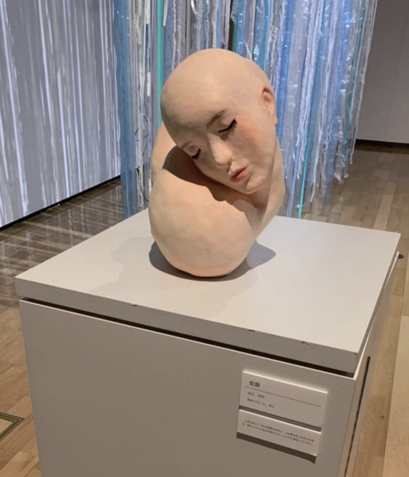
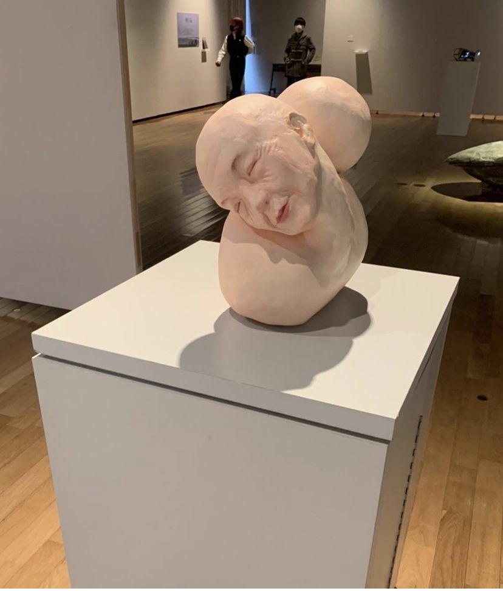

<!DOCTYPE html>
<html>
  <head>
    <meta charset="utf-8">
    
    <link rel="stylesheet" href="stylesheet.css">
    <link rel="responsive" href="responsive.css">
  </head>
  <body>
    <header>
        
        

         <a href="#">◁BACK TO TOP</a>
        <a href="#">NEXT▷</a>
        
        

    </header>

    <body>
        
        
    </body>

      </body>

</html>
